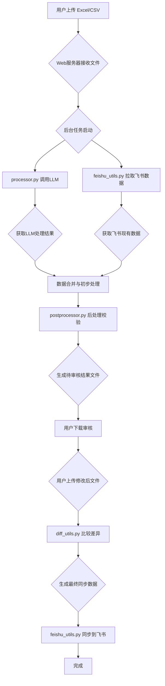

# 表格数据清洗与飞书同步工具 项目结构
> 生成时间: 2025-05-01 11:14:14

## 1. 总体目录结构

```
excel_clean_cursor
├── README.md
├── app.py
├── check_dependencies.py
├── config.json
├── diff_utils.py
├── feishu_utils.py
├── postprocessor.py
├── processor.py
├── project_structure.md
├── project_structure.txt
├── requirements.txt
├── run_flask_app.sh
├── setup.sh
├── static/
│   ├── images/
│   │   ├── 手机号重复.png
├── templates/
│   ├── index.html
├── update_requirements.py
├── 制作Dock应用指南.md
├── 需求文档.md
├── 表格数据清洗工具.applescript
```

## 2. 核心模块与功能详解

### 2.1 主要API路由 (Flask)
从 `.py` 文件中 `@app.route` 或类似装饰器提取的接口：

#### GET接口
| 路由路径 | 处理函数 | 功能描述 |
|----------|----------|----------|
| `/` | `未知文件::index()` | 渲染应用程序主页面，提供文件上传和配置设置界面。 |
| `/check_diff/<task_id>` | `未知文件::check_differences()` | 比较原始处理结果与用户编辑后文件的差异。 |
| `/download/<task_id>/<filename>` | `未知文件::download_file()` | 下载指定任务的处理结果文件。 |
| `/progress/<task_id>` | `未知文件::progress()` | 查询指定任务ID的处理进度和状态。 |

#### POST接口
| 路由路径 | 处理函数 | 功能描述 |
|----------|----------|----------|
| `/save_config` | `未知文件::save_config_route()` | 保存用户定义的配置为系统默认值。 |
| `/sync_to_feishu/<task_id>` | `未知文件::sync_to_feishu()` | 将数据同步到飞书多维表格。 |
| `/upload` | `未知文件::upload_files()` | 处理用户上传的Excel/CSV文件并启动后台处理任务。 |
| `/upload_edited/<task_id>` | `未知文件::upload_edited_file()` | 上传用户手动编辑后的Excel文件。 |

### 2.1.1 API接口详细说明

#### `GET /`
- **处理函数**: `index()`
- **功能描述**: 渲染应用程序主页面，提供文件上传和配置设置界面。
- **返回值**: HTML: 渲染后的index.html页面，包含所有配置参数

#### `GET /check_diff/<task_id>`
- **处理函数**: `check_differences()`
- **功能描述**: 比较原始处理结果与用户编辑后文件的差异。
- **返回值**: JSON: 比较结果对象，包含:; - summary: 变更摘要统计(新增/修改/删除条数); - diffs: 详细变更记录列表; - columns: 比较的列名列表

#### `GET /download/<task_id>/<filename>`
- **处理函数**: `download_file()`
- **功能描述**: 下载指定任务的处理结果文件。
- **返回值**: File: 处理结果文件的下载响应; 或 JSON错误信息: 文件不存在/目录不存在/文件名无效

#### `GET /progress/<task_id>`
- **处理函数**: `progress()`
- **功能描述**: 查询指定任务ID的处理进度和状态。
- **返回值**: JSON: 包含任务状态、进度百分比、处理文件信息和结果文件名(如果完成)

#### `POST /save_config`
- **处理函数**: `save_config_route()`
- **功能描述**: 保存用户定义的配置为系统默认值。
- **返回值**: JSON: 表示保存成功或失败的消息

#### `POST /sync_to_feishu/<task_id>`
- **处理函数**: `sync_to_feishu()`
- **功能描述**: 将数据同步到飞书多维表格。
- **返回值**: JSON: 同步操作结果，包含添加/更新/删除的记录数和错误信息

#### `POST /upload`
- **处理函数**: `upload_files()`
- **功能描述**: 处理用户上传的Excel/CSV文件并启动后台处理任务。
- **请求参数**: - files[]: 上传的Excel/CSV文件列表; - config_target_columns: 目标列名称列表(JSON); - config_api_key: DeepSeek API密钥; - config_batch_size: 批处理大小; - config_max_tokens: 最大Token数; - config_api_timeout: API超时时间; - feishu_*: 多个飞书API配置参数; - post_process_config: 后处理配置(JSON)
- **返回值**: JSON: 包含task_id的响应，用于前端查询任务进度

#### `POST /upload_edited/<task_id>`
- **处理函数**: `upload_edited_file()`
- **功能描述**: 上传用户手动编辑后的Excel文件。
- **请求参数**: - edited_file: 用户编辑后的Excel文件
- **返回值**: JSON: 上传成功或失败信息，成功时包含编辑后的文件名

## 2.2 Python 模块详情 (`.py`)
按文件列出主要的类和函数：

#### ` app.py `

- **函数:**
  - `load_config()`: 尝试从 config.json 加载配置，如果失败则使用默认值并保存。
  - `progress_callback()`: 无文档字符串
  - `run_processing()`: 在后台线程中运行的包装函数，调用 processor 的主处理函数并更新任务状态。
  - `save_config()`: 将配置数据写入 config.json 文件。
  - `update_task_progress()`: 由 processor 模块调用的回调函数，用于更新全局 tasks 字典中的任务状态。
---
#### ` check_dependencies.py `

- **函数:**
  - `compare_dependencies()`: 比较requirements.txt和已安装的包
  - `get_installed_packages()`: 获取当前环境中已安装的包
  - `parse_requirements()`: 解析requirements.txt文件
  - `print_report()`: 打印依赖检查报告
---
#### ` diff_utils.py `

- **函数:**
  - `compare_dataframes_hybrid()`: Compares two DataFrames using a dedicated local ID column as the primary key.
  - `compare_subset()`: Compares two DataFrames based on a key, identifying added, deleted, and modified rows.
---
#### ` feishu_utils.py `

- **函数:**
  - `batch_add_records()`: 批量添加新记录到飞书多维表格。
  - `batch_delete_records()`: 批量删除飞书多维表格中的记录。
  - `batch_update_records()`: 批量更新飞书多维表格中的记录。 Args: records_to_update: 字典列表，每个字典包含 'record_id' 和 'fields' (要更新的字段键值对)。 例如: [{'record_id': 'recxxxx', 'fields': {'字段A': '新值A'}}]
  - `fetch_all_records_from_table()`: 获取单个表格的所有记录 (包含 record_id)
  - `fetch_and_prepare_feishu_data()`: 获取所有指定飞书表格的数据，并将其合并、准备成 DataFrame。
  - `get_access_token()`: 获取租户访问令牌 (Tenant Access Token)
  - `get_table_record_count()`: 获取指定飞书多维表格的记录总数。 使用 /records/search?page_size=1 端点获取包含 total 字段的响应。
---
#### ` postprocessor.py `

- **函数:**
  - `apply_post_processing()`: 应用所有选定的后处理步骤。
  - `check_company_similarity_deepseek()`: 使用 DeepSeek API 判断公司名称列表是否指向同一或关联实体。 (您提供的代码，稍作调整以适应这里的上下文)
  - `check_duplicate_phone_and_company()`: 检查 DataFrame 中手机号和公司名都重复的行，并在备注列添加标记。 Args: df: 需要处理的 DataFrame。 phone_col: 电话号码列名。 company_col: 公司名称列名。 remark_col: 备注列名。
  - `check_duplicate_phones()`: 检查 DataFrame 中的重复手机号，并在备注列添加标记。
  - `check_related_companies_for_duplicate_phones_llm()`: 对于备注中标记了"电话号码重复"但未标记"手机号+公司名重复"的行， 使用 LLM 检查同一手机号下的不同公司名是否相关，并在新列中记录相关名称。 Args: df: 需要处理的 DataFrame。 phone_col: 电话号码列名。 company_col: 公司名称列名。 remark...
  - `create_multi_sheet_excel()`: 创建包含多个Sheet页的Excel文件： 1. 原始数据 - 包含所有数据 2. 新增 - 不含record_id的数据 3. 更新 - 包含record_id的数据
  - `merge_duplicate_phones()`: 处理电话号码重复的情况： 1. 电话相同但企业不同且无关联 - 合并企业名称(分号隔开) 2. 电话相同且企业相同或有关联 - 保留一行(优先record_id)
  - `validate_phone_format()`: 校验指定列是否为有效的11位手机号格式，并在备注列标记错误。
---
#### ` processor.py `

- **函数:**
  - `extract_standardize_batch_with_llm()`: 使用 DeepSeek LLM API 对一批数据进行信息提取和标准化。 包含重试逻辑和常见的 API 错误处理。
  - `process_files_and_consolidate()`: 核心处理流程函数，由 app.py 在后台线程中调用。 1. 遍历输入文件列表。 2. 读取每个文件。 3. 将文件内容分批。 4. 调用 LLM API 处理每个批次。 5. 合并处理结果。 6. 将最终结果保存到 Excel 文件。 7. 通过回调函数报告进度。
  - `read_input_file()`: Reads an Excel or CSV file into a Pandas DataFrame. # Removed validation of required columns. Adds a unique local_row_id to each row. *** Removed a...
---
#### ` update_requirements.py `

- **函数:**
  - `get_pip_freeze_packages()`: 获取当前环境中安装的所有包
  - `get_project_imports()`: 扫描项目文件获取所有导入包
  - `scan_imports_from_file()`: 从文件中提取导入的包名
  - `update_requirements_file()`: 更新requirements.txt文件
---

## 3. 前端资源

未找到 JavaScript 文件。

未找到 CSS 文件。

## 4. 数据处理流程概述


(这是一个简化的流程图，具体细节参考代码)
